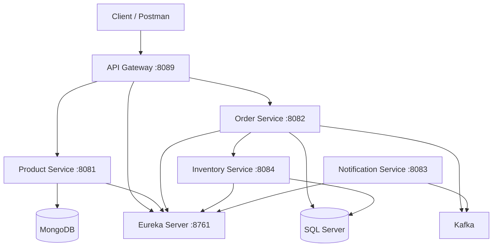

# Microservices E-Commerce Platform

A complete microservices-based e-commerce backend built with Spring Boot and Spring Cloud.

## Architecture Overview



## Services

| Service | Port | Database | Description |
|---------|------|----------|-------------|
| API Gateway | 8089 | - | Single entry point and routing |
| Eureka Server | 8761 | - | Service Discovery |
| Product Service | 8081 | MongoDB | Manage products |
| Order Service | 8082 | SQL Server | Place orders + Circuit Breaker |
| Inventory Service | 8084 | SQL Server | Check and update stock |
| Notification Service | 8083 | - | Consumes Kafka events |

## Tech Stack

- Java 21+ / Spring Boot 3
- Spring Cloud Gateway
- Netflix Eureka
- Apache Kafka
- MongoDB
- Microsoft SQL Server
- Resilience4j (Circuit Breaker, Retry, TimeLimiter)
- SpringDoc OpenAPI (Swagger)
- Keycloak (in progress)
- Docker & Docker Compose

## How to Run

### Prerequisites
- Docker & Docker Compose
- Java 21+
- Maven 3.9+

### Start all services

```bash
docker compose up -d --build
```

### Check status

```bash
docker compose ps
```

### Important URLs

| Service | URL |
|---------|-----|
| Eureka Dashboard | http://localhost:8761 |
| API Gateway | http://localhost:18089 |
| Product Swagger | http://localhost:8081/swagger-ui.html |
| Order Swagger | http://localhost:8082/swagger-ui.html |
| Inventory Swagger | http://localhost:8084/swagger-ui.html |

## Example API Calls

### Create a Product

```bash
curl -X POST http://localhost:18089/api/product \
  -H "Content-Type: application/json" \
  -d "{\"name\": \"iPhone 15\", \"description\": \"Latest iPhone\", \"price\": 999.99}"
```

### Place an Order

```bash
curl -X POST http://localhost:18089/api/order \
  -H "Content-Type: application/json" \
  -d "{\"orderLineItemsList\": [{\"skuCode\": \"iphone_15\", \"price\": 999.99, \"quantity\": 1}]}"
```

## Key Features

- Service Discovery with Eureka
- API Gateway as single entry point
- Event-driven communication using Kafka
- Circuit Breaker pattern with Resilience4j
- Database per Service pattern
- Fully Dockerized environment
- Swagger / OpenAPI documentation

## Profiles

| Profile | Usage |
|---------|-------|
| `local` | Running services from IDE |
| `docker` | Running inside Docker Compose |

## Future Improvements

- [ ] Complete Keycloak authentication
- [ ] Distributed Tracing (Zipkin)
- [ ] Prometheus + Grafana
- [ ] Unit & Integration tests
- [ ] CI/CD with GitHub Actions
- [ ] Dead Letter Topic for Kafka

---

**Author:** Islam  
**Project Status:** In active development
```
