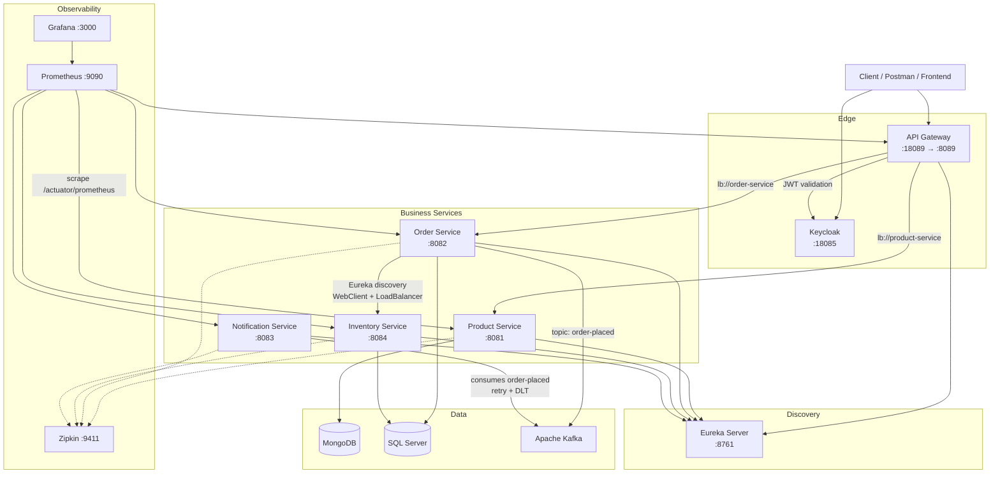

# Microservices E-Commerce Platform

A complete microservices-based e-commerce backend built with Spring Boot and Spring Cloud.

## Architecture Overview



## Services

| Service              | Port (host) | Database     | Role                                      |
|----------------------|-------------|--------------|-------------------------------------------|
| API Gateway          | 18089       | —            | Entry point, JWT, routing                 |
| Eureka Server        | 8761        | —            | Service discovery & registry              |
| Product Service      | 8081        | MongoDB      | Product catalog CRUD                      |
| Order Service        | 8082        | SQL Server   | Orders, circuit breaker, Kafka producer   |
| Inventory Service    | 8084        | SQL Server   | Stock checks by SKU (internal only)       |
| Notification Service | 8083        | —            | Kafka consumer + DLT                      |
| Keycloak             | 18085       | —            | Identity / JWT issuer                     |
| Zipkin               | 9411        | —            | Distributed tracing                       |
| Prometheus           | 9090        | —            | Metrics scraping                          |
| Grafana              | 3000        | —            | Dashboards                                |
## Security (Keycloak)

- **Realm:** `spring-boot-microservice-realm`
- **Client:** `spring-boot-microservice-client` (public, direct access grants)

| Username | Password   | Roles        |
|----------|------------|--------------|
| `user`   | `password` | USER         |
| `admin`  | `password` | USER, ADMIN  |

### Get an access token

```bash
TOKEN=$(curl -s -X POST "http://localhost:18085/realms/spring-boot-microservice-realm/protocol/openid-connect/token" \
  -H "Content-Type: application/x-www-form-urlencoded" \
  -d "client_id=spring-boot-microservice-client" \
  -d "username=admin" \
  -d "password=password" \
  -d "grant_type=password" | jq -r .access_token)

echo $TOKEN
## Tech Stack

| Category           | Technology                                              |
|--------------------|---------------------------------------------------------|
| Language / Runtime | Java 21+ / Spring Boot 3                                |
| Cloud              | Spring Cloud Gateway, Netflix Eureka                    |
| Resilience         | Resilience4j (Circuit Breaker, Retry, TimeLimiter)      |
| Messaging          | Apache Kafka (`order-placed` + `order-placed.DLT`)      |
| Databases          | MongoDB (Product), Microsoft SQL Server (Order/Inventory) |
| API Docs           | SpringDoc OpenAPI (Swagger UI)                          |
| Validation         | Jakarta Validation (`@Valid`, `@NotBlank`, …)           |
| Security           | Keycloak (JWT + realm roles USER / ADMIN)               |
| Observability      | Actuator, Prometheus, Grafana, Zipkin                   |
| Testing            | JUnit 5, Mockito, MockWebServer, Testcontainers         |
| CI/CD              | GitHub Actions                                          |
| Containers         | Docker & Docker Compose                                 |

## How to Run

### Prerequisites
- Docker & Docker Compose
- Java 21+
- Maven 3.9+

### Start all services

```bash
docker compose up -d --build
```

### Check status

```bash
docker compose ps
```

### Important URLs

| What                   | URL                                    |
|------------------------|----------------------------------------|
| Eureka Dashboard       | http://localhost:8761                  |
| API Gateway            | http://localhost:18089                 |
| Keycloak Admin         | http://localhost:18085 (admin / admin) |
| Zipkin UI              | http://localhost:9411                  |
| Prometheus             | http://localhost:9090                  |
| Grafana                | http://localhost:3000 (admin / admin)  |
| Product Swagger        | http://localhost:8081/swagger-ui.html  |
| Order Swagger          | http://localhost:8082/swagger-ui.html  |
| Inventory Swagger      | http://localhost:8084/swagger-ui.html  |
## Example API Calls

### Create a Product

```bash
curl -X POST http://localhost:18089/api/product \
  -H "Content-Type: application/json" \
  -d "{\"name\": \"iPhone 15\", \"description\": \"Latest iPhone\", \"price\": 999.99}"
```

### Place an Order

```bash
curl -X POST http://localhost:18089/api/order \
  -H "Content-Type: application/json" \
  -d "{\"orderLineItemsList\": [{\"skuCode\": \"iphone_15\", \"price\": 999.99, \"quantity\": 1}]}"
```

## Key Features Implemented

- **Service Discovery** – Eureka; inter-service calls by service name
- **API Gateway** – Single public entry point with path-based routing
- **Database per Service** – Product → MongoDB; Order/Inventory → SQL Server
- **Event-driven** – Order publishes `order-placed`; Notification consumes it
- **Resilience** – Circuit Breaker + Retry + TimeLimiter around Inventory
- **Request Validation** – Jakarta Validation on DTOs and controllers
- **Global Exception Handling** – Consistent JSON `ErrorResponse` across services
- **OpenAPI / Swagger** – Product, Order, Inventory
- **Keycloak Security** – JWT resource server on Gateway; roles `USER` / `ADMIN`
- **Role-based access** – GET product public; POST product = ADMIN; orders = USER/ADMIN
- **Internal services protected** – Inventory not exposed via Gateway
- **Observability** – Actuator + Prometheus + Grafana + Zipkin
- **Kafka resilience** – Consumer retry + Dead Letter Topic (`order-placed.DLT`)
- **Unit & integration tests** – Service-layer tests + Testcontainers (Product)
- **CI** – GitHub Actions (`mvn verify` on push/PR)
- **Fully Dockerized** – One `docker compose up` starts the full stack
## Profiles

| Profile | Usage |
|---------|-------|
| `local` | Running services from IDE |
| `docker` | Running inside Docker Compose |


---


> مهم: اسم الحقل **`orderLineItemsDtoList`** مش `orderLineItemsList`.

---

### 9) قسم Testing & CI 

```markdown
## Testing & CI

### Unit tests

| Test | What it covers |
|------|----------------|
| `ProductServiceTest` | create / list / getById / not-found |
| `InventoryServiceTest` | in-stock / out-of-stock / multiple SKUs |
| `OrderServiceTest` | success, insufficient stock, inventory HTTP error (MockWebServer) |

### Integration tests

- **ProductIntegrationTest** – Testcontainers MongoDB + HTTP against random port

### Run tests locally

```bash
mvn -B clean verify -Dmaven.compiler.release=21

### 10) Project Structure

```markdown
## Project Structure

```text
microservice-new/
├── api-gateway/           # Spring Cloud Gateway + JWT resource server
├── discovery-server/      # Netflix Eureka
├── Product-service/       # MongoDB product catalog
├── order-service/         # Orders + Kafka producer + Resilience4j
├── inventory-service/     # Stock checks (internal only)
├── notification-service/  # Kafka consumer + DLT
├── keycloak/              # Realm export (roles, users, client)
├── observability/         # Prometheus + Grafana provisioning
├── postman/               # Postman collection
├── .github/workflows/     # CI pipeline
├── docker-compose.yaml
├── Dockerfile
└── pom.xml

---

### 11) Roadmap + Status (آخر الملف)

```markdown
## Roadmap

- [x] Request validation & global exception handling
- [x] Eureka-based service-to-service calls
- [x] Consistent Kafka topic naming (`order-placed`)
- [x] Keycloak JWT validation in API Gateway
- [x] Role-based access (USER / ADMIN)
- [x] Internal services not exposed via Gateway
- [x] Distributed tracing (Zipkin)
- [x] Prometheus + Grafana
- [x] Kafka retry + Dead Letter Topic
- [x] Unit & integration tests
- [x] GitHub Actions CI
- [ ] Order lifecycle + inventory reservation
- [ ] Flyway migrations + optimistic locking
- [ ] Transactional outbox pattern

---

**Author:** Islam  
**Repository:** [github.com/islamsoliman1/microservice-new](https://github.com/islamsoliman1/microservice-new)  
**Status:** Phases 2–6 complete (portfolio, quality, security, observability, testing & CI)

